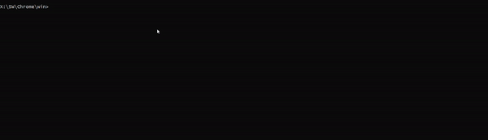

# WEB SNAP SHOT
This is a Simple Java Command line Application that takes a list of Urls and creates


# Demo



## Getting started
To get started you need the following from the [Internet if you havent already]()
1. Ensure Java is setup on the filesystem. If not head over at [Java Home](https://www.java.com/en/download/).
2. Download Chrome driver into the file system. Get it [Here](http://chromedriver.chromium.org/downloads)
3. List of Urls you want to generate screenshot. 
4. The operations is straight forward plus the solution includes a mini commandline "manual".


For testing purposes, ensure you validate that the above pre-requisites are setup fully.
Use the *the actual jar path* and *the actual chrome drive path* depending on the operating system.

## Testing the code
1. Clone the repo and build the jar file. 
    
2. Tesing web snapshot solution.

    SYNTAX

    ``` java -jar [jar-path] [<configurations>] [data]```

    EXAMPLE

    ``` --path=/SW/Chrome/chromedriver.exe, --output=./test-folder/, https://www.google.com```
    
 3. You can optionally pass the define the destination folder location after  ```--output``` tag , e.g. `--output=../temp-dir/`.
    
    e.g. `--output=../temp-dir/`.

 4. Check the File generated in the path below

    ```cd [current-directory-path]/temp/   &&    ls```

## Contributing and Issues
The project is more an R n D that a complete production ready solution. I will work to better provide the solution.
